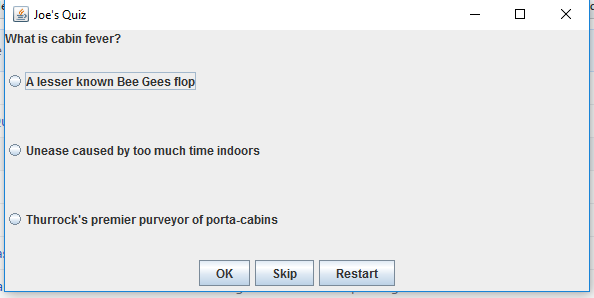

# Programming Coursework
## PART I: GUI-based Online Testing System
Joe Halloran

## 1 Project overview

### 1.1	Object Oriented Structure

To give the project a logical structure it divides functionality into 3 classes:

* `Quiz.java`
	* A higher level class that oversees the entire quiz process.
* `FileHandler.java`
	* Manages all file interaction. Get questions and answers from text files and process them into correct data structures.
* `QuizMaster.java`
	* Handles the mechanics of asking questions and accepting answers. Includes an option to skip questions. Does most of the heavy lifting of the UI, using Java Swing.

### 1.2 Additional features

The project implements all basic and advanced requirements in the specification. It also includes some additional code to allow for:

#### 1.2.1 Any number of questions or answers

The quiz is made of 10 questions in each difficulty mode, but could accommodate:

* Any number of questions, not just 10
* Any number of possible answers, including a different number of possible answers in different questions.

These features require some additional code to process differing length data sizes into fixed length arrays. Examples of this additional code can be found in these methods:

* `FileHandler.readFile()`
    * Uses a `Stack` to check number of questions before initialising and populating a fixed length `String[]` array.
* `FileHandler.getTextAs2DArray()`
    * Requires two loops. One to check maximum length before initialising the array, and then another loop to populate the array.
* `QuizMaster.combineAnswers()`
    * Uses a `Stack` to check number of answers before initialising and populating a fixed length `String[]` array.

#### 1.2.2 Randomises answers for display
Answer options are displayed in a random order each time a question is asked. This is implemented by:

* `QuizMaster.jumbleAnswers()`

<div style="page-break-after: always;"></div>

## 2 Critical evaluation

The project could be improved in the following ways.

### 2.1 Alternative strategy for processing question and answer data

The additional functionality (to allow for any number of questions or answers) obfuscates some of the code and uses additional data structures in a clunky way (e.g. `Stack` in `FileHandler.readFile()` method).

This could have been avoided if question and answer data was handled in a more sophisticated way. This could include:
* Use of an `List` or `ArrayList`.
    * These dynamic data structures may be better able to cope with varying data sizes.
    * These was beyond the scope of the course and I am not sure exactly how to implement these.
* Use of additional classes / objects (e.g. `Question` or `WrongAnswer` class)
    * This could allow more clarity, by making data structure a part of the object oriented structure.

### 2.2 User interface

The Java Swing interface lacks elegance and gives little scope to adjust design (layout, colours, etc…)

An alternative approach could be to use a mark up language e.g. HTML and CSS to allow for a more precise design.

### 2.3 Re-factoring longer methods

Some methods are quite long, and could benefit from re-factoring or splitting into separate methods.

Some of the worst offenders are:
* `QuizMaster.askQuestion()`
* `QuizMaster.resetQuizForSkippedQuestions()`

<div style="page-break-after: always;"></div>

## 3. Test plan

> NOTE: A full listing of evidence is available in [Appendex i: Test Evidence](Appendix-01-test-evidence.md)

|    |Test       |Method         |Expected Result        |Result          |Evidence       |
|-------|-----------|---------------|-----------------------|-----------------------|---------------|
|1    |"Easy" button returns easy questions  |Click on "Easy" in home screen         |Q1 is "What is cabin fever?"        |As expected          |See appendix i       |
|2    |"Hard" button returns hard questions  |Click on "Hard" in home screen         |Q1 is "Who likes cheese the most?"        |As expected          |See appendix i         |
|3    |"Quit" buttons exits gracefully       |Click "Quit" in home screen   |"Thanks for playing" dialogue displayed        |As expected          |See appendix i         |
|4    |"OK" submits answer when question selected  |Choose all correct answers         |100% final score        |As expected          |See appendix i      |
|5    |User prompted if "OK" clicked and no answer selected |Click "OK" without answer selected         |Dialogue prompt appears       |As expected          |See appendix i        |
|6    |"Restart" button returns to home screen       |Click on "Restart" button         |Home screen dialogue appears        |As expected          |None       |
|7    |"Skip" button saves skipped questions until the end of the quiz       |Skip Q1 only         |Q1 appears end of quiz as "Skipped Question 1/1"        |As expected          |See appendix i         |
|8    |"Skipping" for skipped questions at end of quiz       |Skip Q1 and review at end of quiz         |No "Skip" button in UI        |As expected          |See appendix i         |
|9   |Correct calculates final score      |Answer all questions incorrectly         |Final Score 0% and all questions in mistake report        |As expected          |See appendix i        |
|10   |Correct calculates final score      |Answer all questions correctly         |Final Score 100%        |As expected          |See appendix i         |
|11   |Mistake report generates for all incorrect answers       |Answer all questions incorrectly and check report         |All questions in the report        |As expected          |See appendix i         |
|12   |Pressing OK at end of test goes back to the home screen       |Press "OK" in final report screen         |Returns to home screen        |As expected          |None       |
|13   |Radio buttons for answers are in a random order       |Run the test twice and compare Q1 answer order         |Answers are in a different order        |As expected          |See appendix i         |

<div style="page-break-after: always;"></div>

## Appendix i: Test evidence

|Test No.   |Evidence       |
|-------|-----------|
|1    |       |
|2    |         |
|3    |         |
|4    |        |
|5    |        |
|6    |None       |
|7    |         |
|8    |         |
|9   |        |
|10   |         |
|11   |         |
|12   |None       |
|13   |         |

<div style="page-break-after: always;"></div>

## Appendix ii: Source code listing

### Quiz.java

```java
import javax.swing.*;

/**
 * Runs a new quiz.
 */
public class Quiz {

    public static void main(String[] args) {
        Quiz quiz = new Quiz();
    }

    /**
     * Asks user to select difficulty or quits application.
     */
    public Quiz() {
        JFrame frame = new JFrame();
        Object[] options = {"Easy", "Hard", "Quit"};
        int selection = -1;             // Initialise selection to be out of valid range
        String questionText = "Select the difficulty of your quiz";
        while (selection < 0 || selection > 2) {                            // Keep asking until valid selection made
            selection = JOptionPane.showOptionDialog(
                    frame,                              // frame
                    questionText,                       // Question text
                    "Select difficulty",                // Dialogue title
                    JOptionPane.YES_NO_OPTION,          // option type
                    JOptionPane.QUESTION_MESSAGE,       // message behaviour
                    null,                               // do not use a custom Icon
                    options,                            // Object holding button text
                    options[0]);                        // default button
            if (selection == 2) {                                    // Quit selected - end quiz
                die();
            } else if (selection < 0 || selection > 2) {             // Prompt if user does not make a valid selection
                questionText = "Please make a valid selection. \n Select the difficulty of your quiz";
            }
        }
        runQuiz(selection);         // Run quiz based on selection
    }

    /**
     * Run quiz at specified difficulty level
     */
    public void runQuiz(int difficulty) {
        String[] questions;
        String[] correctAnswers;
        String[][] wrongAnswers;
        FileHandler fileHandler = new FileHandler();    // File handler process txt files into correct data structures

        if (difficulty == 0) {
            // Easy
            questions = fileHandler.getTextAsArray("questions-easy.txt");
            correctAnswers = fileHandler.getTextAsArray("correct-answer-easy.txt");
            wrongAnswers = fileHandler.getTextAs2DArray("wrong-answers-easy.txt");
        } else {
            // Hard
            questions = fileHandler.getTextAsArray("questions-hard.txt");
            correctAnswers = fileHandler.getTextAsArray("correct-answer-hard.txt");
            wrongAnswers = fileHandler.getTextAs2DArray("wrong-answers-hard.txt");
        }

        QuizMaster quizMaster = new QuizMaster(
                "Joe's Quiz",               // quiz title
                questions,                  // question text array
                correctAnswers,             // correct answers array
                wrongAnswers);              // wrong answers 2D array
    }

    /**
     * Quit quiz gracefully.
     */
    public static void die() {
        JOptionPane.showMessageDialog(null, "Thanks for playing");
        System.exit(0);
    }
}
```

### FileHandler.java

```java
import java.io.File;
import java.io.IOException;
import java.util.Scanner;
import java.util.Stack;

/**
 * Reads text files to get quiz questions and answers. Processes into arrays.
 */
public class FileHandler {

    /**
     * Wrapper to handle IO exceptions
     *
     * Returns array from readFile method
     */
    public String[] getTextAsArray(String fileName) {

        String[] text = null;
        try {
            text = readFile(fileName);
        } catch (IOException e) {
            e.printStackTrace();
        }
        return text;
    }

    /**
     * Handles complexity of reading the questions text file and processing into array.
     * Uses stacks to allow for possibility of different number of questions in quiz.
     *
     * Returns an array where each line of text file is nth item in array
     */
    private static String[] readFile(String fileName) throws IOException {
        // Add text file lines into stack;
        String fileLine;
        Stack textStack = new Stack();
        Scanner fileScan;
        File questionFile = new File(fileName);
        fileScan = new Scanner(questionFile);
        while (fileScan.hasNext()) {
            fileLine = fileScan.nextLine();
            textStack.push(fileLine);
        }
        // Initialise output array and populate from stack;
        String[] outputArray = new String[textStack.size()];
        // Iterate backwards through the array to add items from the stack
        int i = (outputArray.length) - 1;
        while (!textStack.empty()) {
            outputArray[i] = (String) textStack.pop(); //Type case to string
            i--;
        }
        return outputArray;
    }

    /**
     * Processes file array into a 2D array,
     * comma separating each line of the text file
     */
    public String[][] getTextAs2DArray(String fileName) {
        // Get input array
        String[] inputArray = getTextAsArray(fileName);
        // find max length of text in rows to correctly initialise 2D array for any number of items
        int maxLength = 0;
        for (int k = 0; k < inputArray.length; k++) {
            String[] splitText = inputArray[k].split(",");
            if (splitText.length > maxLength) {
                maxLength = splitText.length;
            }
        }
        // Initialise and populate output array
        String[][] outputArray = new String[inputArray.length][maxLength];
        for (int i = 0; i < inputArray.length; i ++) {
            String[] splitText = inputArray[i].split(",");
            for (int j = 0; j < splitText.length; j++) {
                outputArray[i][j] = splitText[j];
            }
        }
        return outputArray;
    }
}
```

### QuizMaster.java

```java
import javax.swing.*;
import java.awt.*;
import java.awt.event.ActionEvent;
import java.awt.event.ActionListener;
import java.util.Stack;


/**
 * Handles asking of questions and process answers.
 * Includes UI
 * Also facilitates skipping of questions and will report wrong answers at the end of the quiz
 */
public class QuizMaster implements ActionListener{

    /**
     * Attributes
     */
    public int score;
    public int questionCounter;                 // Question index
    public boolean skippingQuestions;

    public String currentAnswer = null;         // Current selected answer (radio buttons)

    public String[] questions;
    public String[] correctAnswers;
    public String[][] wrongAnswers;

    int maxLenghtWrongAnswersSubArray = 0;     // Used in quiz reset to handle jagged 2D array of wrong answers

    public String mistakesReport = "";
    public Stack skipped = new Stack();

    public JFrame frame = new JFrame();

    /**
     * Constructor intialises essential attributes
     */
    public QuizMaster(String quizTitle,
                      String[] questionInput,
                      String[] correctAnswerInput,
                      String[][] wrongAnswersInput){

        frame.setTitle(quizTitle);
        skippingQuestions = true;
        questionCounter = 0;
        questions = questionInput;
        correctAnswers = correctAnswerInput;
        wrongAnswers = wrongAnswersInput;
        // Ask first question
        askQuestion(questions[questionCounter], correctAnswers[questionCounter], wrongAnswers[questionCounter]);

    }

    /**
     * Builds the question asking UI for each question
     */
    public void askQuestion(String questionText, String correctAnswer, String[] wrongAnswers) {

        // Setup panels
        JPanel mainPanel = new JPanel();
        mainPanel.setLayout(new BorderLayout());

        JPanel questionPanel = new JPanel();
        questionPanel.setLayout(new GridLayout(0,1));

        JPanel answersPanel = new JPanel();
        answersPanel.setLayout(new GridLayout(0,1));

        JPanel controlsPanel = new JPanel();
        controlsPanel.setLayout(new FlowLayout());

        // Create question text label
        JLabel questionLabel = new JLabel();
        questionLabel.setText(questionText);

        // Create "OK" button
        JButton submitButton  = new JButton();
        submitButton.setText("OK");
        submitButton.setActionCommand("submit");
        submitButton.addActionListener(this);

        // Create "Skip" button
        JButton skipButton  = new JButton();
        skipButton.setText("Skip");
        skipButton.setActionCommand("skip");
        skipButton.addActionListener(this);

        // Create "Quit" button
        JButton restartButton  = new JButton();
        restartButton.setText("Restart");
        restartButton.setActionCommand("restart");
        restartButton.addActionListener(this);

        // Create radio buttons for answers
        String[] allAnswers = combineAnswers(correctAnswer, wrongAnswers);
        ButtonGroup answerGroup = new ButtonGroup();
        JRadioButton[] answerButtons = new JRadioButton[allAnswers.length];
        for(int i = 0; i < allAnswers.length; i++) {
            answerButtons[i] = new JRadioButton();
            answerButtons[i].setText(allAnswers[i]);
            answerButtons[i].addActionListener(this);
            answerGroup.add(answerButtons[i]);
            answersPanel.add(answerButtons[i]);
        }

        // Add "OK", "Skip" and "Quit" buttons
        controlsPanel.add(submitButton);
        // Handle GUI for skipping
        if (skippingQuestions) {
            // Add skip button, if skipping allowed
            controlsPanel.add(skipButton);
        } else {
            // If answering skipped questions tell user
            JLabel skipLabel = new JLabel();
            skipLabel.setText("Skipped Question " + (questionCounter + 1) + "/" + questions.length);
            questionPanel.add(skipLabel);
        }
        controlsPanel.add(restartButton);

        questionPanel.add(questionLabel);
        // Load frame
        mainPanel.add(questionPanel, BorderLayout.NORTH);
        mainPanel.add(answersPanel, BorderLayout.CENTER);
        mainPanel.add(controlsPanel, BorderLayout.SOUTH);

        frame.add(mainPanel);
        frame.pack();
        frame.setSize(600, 300);
        frame.setLocationRelativeTo(null);  // Centre frame in window
        frame.setVisible(true);
        frame.setDefaultCloseOperation(JFrame.EXIT_ON_CLOSE);

    }

    /**
     * Handles all button clicks
     */
    @Override
    public void actionPerformed(ActionEvent e) {

        String command = e.getActionCommand();
        if (command.equalsIgnoreCase("submit")) {
            if (currentAnswer == null) {     // No answer given, prompt user to answer
                String userPrompt = "You have not answered the current question.";
                userPrompt = userPrompt + "\nYou may skip the question and return to it later on.";
                JOptionPane.showMessageDialog(null, userPrompt );
            } else {                         // Answer supplied, process and move on
                checkAnswer();
                nextQuestion();
            }
        } else if (command.equalsIgnoreCase("skip")) {      // User presses skip
            // Used to handle jagged 2D in case of quiz reset
            if (wrongAnswers[questionCounter].length > maxLenghtWrongAnswersSubArray) {
                maxLenghtWrongAnswersSubArray = wrongAnswers[questionCounter].length;
            }
            // Add to skipped stack
            skipped.push(questionCounter);
            nextQuestion();
        } else if (command.equalsIgnoreCase("restart")) {       // Reset. Back to start screen
            frame.dispose();
            Quiz quiz = new Quiz();

        } else {            // The user has not pressed submit, skip, or quit, so must have selected a new answer.
            currentAnswer = command;
        }
    }

    /**
     * Ask next question or end quiz if no questions left
     */
    public void nextQuestion(){
        frame.dispose();
        currentAnswer = null;       // Nulled to allow prompt if no answer is selected
        questionCounter++;
        if (questionCounter < correctAnswers.length) {              // Next question
            frame = new JFrame("Joe's quiz");
            askQuestion(questions[questionCounter], correctAnswers[questionCounter], wrongAnswers[questionCounter]);
        } else if (skippingQuestions && !(skipped.empty())) {       // Begin answering the skipping questions
            resetQuizForSkippedQuestions();
        } else {                                                    // End quiz
            endQuiz();
        }
    }

    /**
     * Handles reset of quiz to re-ask skipped questions
     */
    private void resetQuizForSkippedQuestions() {
        skippingQuestions = false;      // Turn off skipping

        // Create new data structures for skipped Questions
        int stackSize = skipped.size();         // Cache for array lengths
        String[] skippedQuestions = new String[stackSize];
        String[] skippedCorrectAnswers = new String[stackSize];
        String[][] skippedWrongAnswers = new String[stackSize][maxLenghtWrongAnswersSubArray];

        // Process data into data structures
        int counter = stackSize - 1;
        while (!skipped.empty()) {
            int skippedQuestionNumber = (int) skipped.pop(); // Typecast to int
            skippedQuestions[counter] = questions[skippedQuestionNumber];
            skippedCorrectAnswers[counter] = correctAnswers[skippedQuestionNumber];
            for (int i = 0; i < wrongAnswers[skippedQuestionNumber].length; i++) {
                skippedWrongAnswers[counter][i] = wrongAnswers[skippedQuestionNumber][i];
            }
            counter--;
        }

        // Reset global variables and begin asking skipped questions
        questions = skippedQuestions;
        correctAnswers = skippedCorrectAnswers;
        wrongAnswers = skippedWrongAnswers;
        questionCounter = -1;       // Reset to -1 as nextQuestion() will increment to 0
        nextQuestion();
    }

    /**
     * Generates a report for users at the end of the quiz
     */
    public void endQuiz(){
        // Add final score to message
        String finalMessage =  "Your have scored = "+score+" points.\n This is equivalent to " + (score * 10) + "% \n";
        // Show mistakes (if any made)
        if (mistakesReport.length() > 0) {
            finalMessage = finalMessage + "\nMISTAKES:\n" + mistakesReport;
        }
        finalMessage = finalMessage +  "\n Well Done!";
        JOptionPane.showMessageDialog(null, finalMessage);

        // Start again
        frame.dispose();
        Quiz quiz = new Quiz();
    }

    /**
     * Check answers and handle correct and incorrect answers
     */
    private void checkAnswer() {
        if (currentAnswer == correctAnswers[questionCounter]) {     // Correct
            score = score + 1;
        } else {                                                    // Wrong
            updateMistakeReport();
        }
    }

    /**
     * Combines the correct answer and wrong answers into a single array
     * to allow creation of radio buttons
     */
    private String[] combineAnswers(String correctAnswer, String[] wrongAnswers) {
        // Use a stack to allow for variable lengths of wrong answer arrays
        Stack answerStack = new Stack();
        for (int i = 0; i < wrongAnswers.length; i++) {
            if (wrongAnswers[i] != null) {      // check for null values which may exist in jagged arrays
                answerStack.push(wrongAnswers[i]);
            }
        }
        answerStack.push(correctAnswer);        // Add correct answer to stack

        // Unpack stack into an array
        String[] answerList = new String[answerStack.size()];
        int counter = 0;
        while (!answerStack.empty()) {
            answerList[counter] = (String)answerStack.pop(); // Typecast to string
            counter++;
        }
        jumbleAnswers(answerList);          // Randomise order of answers
        return answerList;
    }

    /**
     * Randomises the answer array so it appears differently for each users
     * Behaves like a shuffle cards (swaps two randomly selected items)
     */
    private void jumbleAnswers(String[] answers) {
        // Shuffle the answers 50 times
        for(int i = 0; i < 50; i++){
            int swapItemOne = (int) Math.floor(Math.random() * answers.length);
            int swapItemTwo = (int) Math.floor(Math.random() * answers.length);
            String temp = answers[swapItemOne];
            answers[swapItemOne] = answers[swapItemTwo];
            answers[swapItemTwo] = temp;
        }
    }

    /**
     * Add incorrect answers to the mistakeReport for display at end of quiz
     */
    private void updateMistakeReport() {
        mistakesReport = mistakesReport + "Q: " + questions[questionCounter];
        mistakesReport = mistakesReport + "\nCorrect answer: " + correctAnswers[questionCounter] + "\n";
    }

}

```

<div style="page-break-after: always;"></div>

## Appendix iii: Supplementary text file listing

Supplementary listing of text files containing questions and answers.

### questions-easy.txt
```
What is cabin fever?
Scrum?
Very tall people are...
Cramped spaces are...
Zebras are...
White supremacy  is...
Former UN Secretary General Kofi Anan thinks...
How do you confuse a marauding shark?
Question nine is...
Did you like this quiz?
```

### correct-answer-easy.txt
```
Unease caused by too much time indoors
No thanks
shorter than most trees
small and disconcerting
like stripey horses
racist and abhorrent
world peace is good
Punch it in the nose
ninth
Yes
```
### wrong-answer-easy.txt
```
A lesser known Bee Gees flop,Thurrock's premier purveyor of porta-cabins
Yes please
taller than most trees,equal height to most trees
small,disconcerting
scary,in a constant state of existential angst
a shade of dulux paint
sundays are tedious,clowns are terrifying,Donald Trump can "do one"
Do a happy dance,Discuss Kantian metaphysics
ninety ninth,high minded,never
No
```

### questions-hard.txt
```
Who likes cheese the most?
Who am I?
Who spent every Sunday in 1996 sculpting carrots into Boris Yeltsin miniatures?
How many boiled eggs can the average bearded man eat in one sitting?
How many hairs were in Tsar Nicholas II's moustache?
Sorry, what did you say?
I like you?
To whom did Queen Elizabeth I say "S**t off!" upon hearing news of the Spanish Armada?
I like you now?
That was a stupid quiz...
```

### correct-answer-hard.txt
```
Denzel Washington
Me
Cher
21
12103
Nothing
Yes
Sir Walter Raleigh
Yes
Yes
```

### wrong-answer-hard.txt
```
The will of the people,Michael Portillo,The Saturdays
Id and Ego and Super Ego,A shadow of my former self,An unrepresentative sample of middle-age middle-class Viennese women
Bobby Davro,Boris Yeltsin,Mikhail Gorbachev
19,23,417
11032,11712,10986
Sometimes I just want to dance and be free
No
Walter Scott,Walter load of rubbish,Walt Disney
No
Sorry who are you?,Dziga Vertov
```
